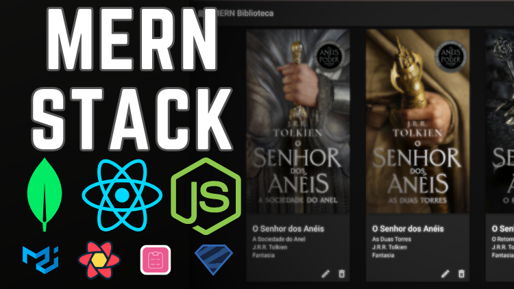

# MERN Stack Book Shelf Application

Este repositório contém uma aplicação full-stack desenvolvida usando a stack MERN (MongoDB, Express, React, Node.js). O projeto é uma estante de livros que permite cadastrar e gerenciar livros com informações como título, subtítulo, autor, gênero e imagem da capa. A aplicação é projetada para ser responsiva e otimizada para atualizações de estado em tempo real.

## Links dos cursos

- https://bit.ly/3XwDMd7
- https://bit.ly/3XeY6yl



## Tecnologias Utilizadas

### MongoDB

- **Descrição:** Banco de dados NoSQL orientado a documentos, ideal para armazenar dados em formato JSON flexível.
- **Vantagens:** Esquema dinâmico, alta escalabilidade e suporte para consultas complexas.

### Express

- **Descrição:** Framework minimalista para Node.js que simplifica o desenvolvimento de servidores web e APIs.
- **Vantagens:** Arquitetura de middleware, sistema de roteamento flexível e integração simplificada com outras ferramentas.

### React

- **Descrição:** Biblioteca JavaScript para construção de interfaces de usuário dinâmicas e interativas.
- **Vantagens:** Componentização reutilizável, Virtual DOM para atualização eficiente e fluxo de dados unidirecional para uma arquitetura previsível.

### Node.js

- **Descrição:** Ambiente de execução JavaScript para construção de aplicações escaláveis no lado do servidor.
- **Vantagens:** Modelo de I/O não bloqueante, uso universal de JavaScript e gerenciador de pacotes npm.

## Por que usar a Stack MERN?

A stack MERN é popular devido à sua coesão em torno do JavaScript, permitindo um desenvolvimento unificado e eficiente. Ela é ideal para aplicações modernas que exigem escalabilidade e performance, com uma comunidade robusta que suporta inovação contínua.

## Implantação com AWS App Runner

A aplicação é implantada na AWS usando o AWS App Runner, que simplifica o processo de construção e implantação de aplicações na nuvem. Com a AWS App Runner, a aplicação beneficia-se de escalabilidade automática, segurança integrada e integração perfeita com outros serviços AWS.

### Vantagens do AWS App Runner

- **Implantação Automatizada:** Simplifica a implantação direta do repositório de código.
- **Escalabilidade Automática:** Gerencia o escalonamento com base no tráfego de usuários.
- **Segurança Integrada:** Proporciona conexões seguras e conformidade com as normas de segurança da AWS.

## Como Executar a Aplicação

1. **Clone o Repositório:**

```bash
git clone https://github.com/chgasparoto/mern-curso-intensivo.git
cd mern-curso-intensivo
```

2. **Instale as Dependências:**

```bash
npm install
cd frontend
npm install
cd ..
```

3. **Configure as Variáveis de Ambiente::**

Crie um arquivo .env (ou renomeie ou copie/cole o arquivo [.env-example](.env-example) para .env) com as seguintes variáveis:

```bash
MONGODB_URI=seu-mongodb-uri
PORT=3000
NODE_ENV=development
```

4. **Execute a Aplicação:**

```bash
npm run dev
cd frontend
npm run dev
```

5. **Execute a Aplicação:**

- Abra http://localhost:3000 para ver a aplicação backend em ação.
- Abra http://localhost:5173 para ver a aplicação frontend em ação.

## Licença

Este projeto é licenciado sob a Licença **Creative Commons Attribution-NonCommercial 4.0 International Public License** - veja o arquivo [LICENSE](LICENSE) para mais detalhes.

## Links

### Geral

- [Repositório](https://github.com/chgasparoto/mern-curso-intensivo)

### Backend

- [Node.js e NPM](https://nodejs.org/pt)
- [VSCode](https://code.visualstudio.com/)
- [Git](https://git-scm.com/downloads)
- [Express](https://www.npmjs.com/package/express)
- [MongoDB](https://www.mongodb.com/)
- [Mongoose](https://www.npmjs.com/package/mongoose)
- [Dotenv](https://www.npmjs.com/package/dotenv)
- [Nodemon](https://www.npmjs.com/package/nodemon)
- [Zod](https://www.npmjs.com/package/zod)

### Frontend

- [Vite](https://vitejs.dev/guide/)
- [React](https://react.dev/)
- [Material UI](https://mui.com/material-ui/)
- [React Router](https://reactrouter.com/en/main)
- [React Hook Form](https://react-hook-form.com/)
- [Tanstack React Query](https://tanstack.com/query/v5/docs/framework/react/overview)
- [Axios](https://axios-http.com/)

### Deployment

- [AWS App Runner](https://aws.amazon.com/pt/apprunner/)
- [Calculadora AWS](https://calculator.aws/#/createCalculator/apprunner)
